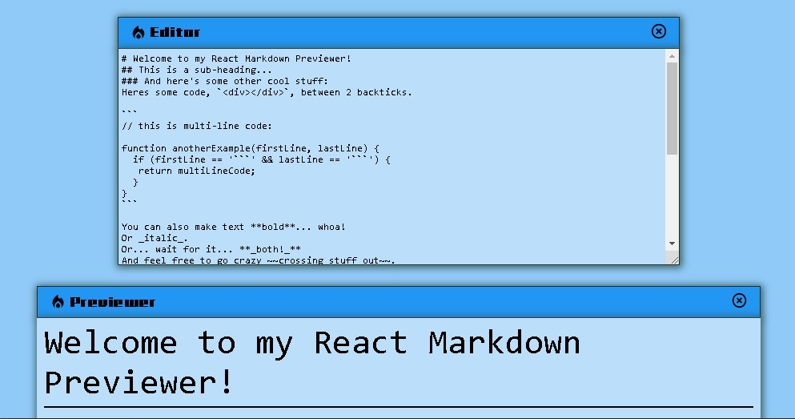

# FreeCodeCamp - Build a Markdown Previewer

This is a solution to the [Build a Markdown Previewer](https://www.freecodecamp.org/learn/front-end-development-libraries/front-end-development-libraries-projects/build-a-markdown-previewer). FreeCodeCamp challenges help you improve your coding skills by building realistic projects. 

## Table of contents

- [Overview](#overview)
  - [Screenshot](#screenshot)
  - [Links](#links)
- [My process](#my-process)
  - [Built with](#built-with)
  - [What I learned](#what-i-learned)
- [Author](#author)

## Overview

### Screenshot

### Links

- Solution URL: [Solution](https://github.com/samuelpklm/build-a-markdown-previewer/tree/doc)
- Live Site URL: [Live Site](https://samuelpklm.github.io/build-a-markdown-previewer/)

## My process

### Built with

- Semantic HTML5 markup
- CSS custom properties
- Flexbox
- Mobile-first workflow
- Regular expressions
- [React](https://reactjs.org/) - JS library
- [Material UI](https://mui.com/) - For styles
- [Redux Toolkit](https://redux-toolkit.js.org/introduction/getting-started) for data management

### What I learned

I learned how to use the Material UI style library. In addition to properly using the React 18! UseEffect Hook. Also to use Redux for data management.

## Author

- Website - [Samuel](https://samuelpklm.github.io/samuel.github.com/)
- Frontend Mentor - [@samuelpklm](https://www.frontendmentor.io/profile/samuelpklm)

